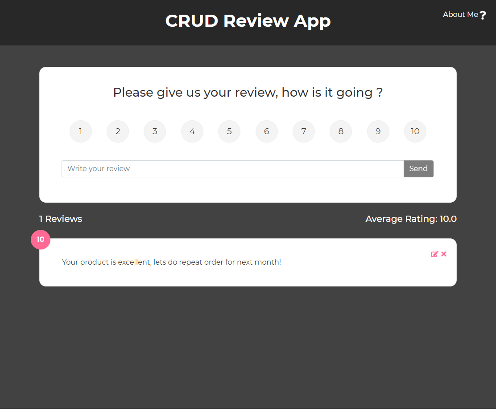
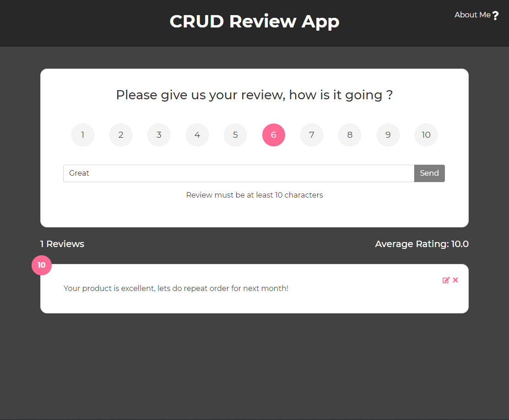
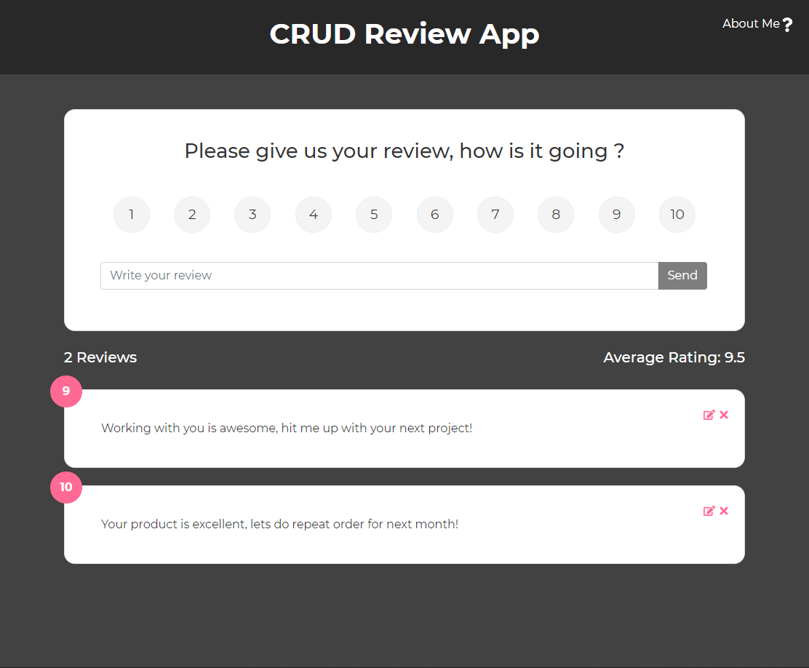
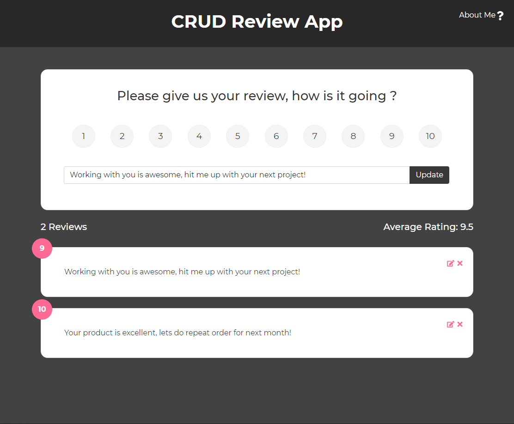
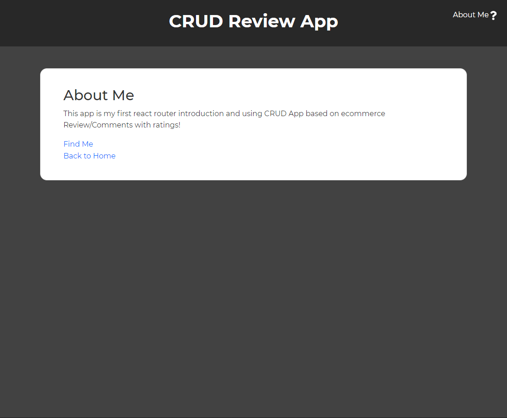

# Overview

CRUD Appp that can be used for products review or comment section on your page.

### Features

- CRUD (Create, Read, Update Delete) with State Management on ReactJs
- Total Review
- Average Review Score
- About Page with React Router

### Screenshot

## My Process

### Built with

- ReactJs (Component Based, State Management, React Hooks)
- CSS3
- Bootstrap 5

### What I Learned

Its a good practice because i started it down with useState and props drilling at first but i change it to useContext and it really make the process much more simpler because having global state is really helpful

### Continued Development

Will try to connect this to firebase as a "mock" backend

## Author

-althafdaa
